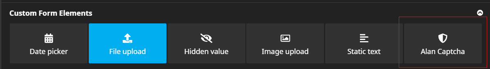

# Alan.NeosForm

Neos plugin to integrate [AlanCaptcha](https://alancaptcha.com/) into Forms. The following form integrations are supported:

- Neos.Form
- Neos.Form.Builder
- Neos.Fusion.From

## Installation

Require the package using composer:

```bash
composer require alan/neos-form
```

Create an account on the [AlanCaptcha Admin Panel](https://my.alancaptcha.com/) and get your Site key and Api key. This is further explained in the [AlanCaptcha documentation](https://docs.alancaptcha.com).

## Usage with [Neos.Form](https://github.com/neos/form)

Just add the new form element to your form definition renderables:
```yaml
label: 'MyLabel'
identifier: myForm
type: 'Neos.Form:Form'
renderables:
  -
    type: 'Neos.Form:Page'
    identifier: page-one
    renderables:
      -
        type: 'Alan.NeosForm:Captcha'
        identifier: captcha
        label: 'Alan Captcha'
        properties:
            apiKey: 'API_KEY'
            siteKey: 'SITE_KEY'
            monitorTag: 'MONITOR_TAG (optional)'
finishers:
  -
    <Your finishers here>
```

## Usage with [Neos.Form.Builder](https://github.com/neos/form-builder)

Add the AlanCaptcha form element to your form:

Configure the element with your AlanCaptcha Api key and Site key.

## Usage with [Neos.Fusion.Form](https://github.com/neos/fusion-form)

Add a `FieldContainer` with the `Alan.NeosForm:FusionForm.Captcha` element to your form:

```
<Neos.Fusion.Form:FieldContainer field.name="captcha">
    <Alan.NeosForm:FusionForm.Captcha siteKey="SITE_KEY" />
</Neos.Fusion.Form:FieldContainer>
```

Set the field name based on our needs, but make sure to use the same field name in the schema (see below).

The following options are available:
- `siteKey` (required): The AlanCaptcha Site Key.

Then, add the field to the schema and configure the Validator:

```
captcha = ${Form.Schema.string().validator('Alan.NeosForm:IsValid', {apiKey: 'API_KEY', errorMessage: 'The Alan Captcha check failed. Try submitting the form again.'})}
```

Make sure that the key (e.g. captcha) matches the key in the FieldContainer (see above).

The following options are available:
- `apiKey` (required): The AlanCaptcha Api Key.
- `errorMessage`: Use this to override the error message in case of a failed captcha check.
